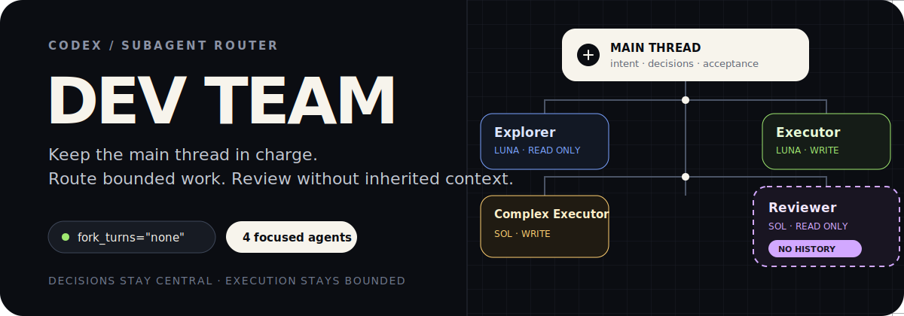

<p align="right">
  <strong>English</strong> · <a href="./README.zh-CN.md">简体中文</a>
</p>

<p align="center">
  
</p>

`dev-team` is a Codex Skill for routing real repository work across four focused custom agents while the main thread stays responsible for decisions, scope, verification, and final delivery.

It is designed around a simple idea: delegation should reduce context noise or save time. It should not become a mandatory ceremony, duplicate a long conversation into every agent, or let an implementation review itself.

<p align="center">
  
</p>

## Four focused roles

- **Explorer · Luna Medium · read-only** — maps repositories, traces call paths, investigates root causes, and identifies impact without editing files.
- **Executor · Luna Medium · workspace-write** — handles clear, localized, low-risk implementation with deterministic checks.
- **Complex Executor · Sol High · workspace-write** — handles substantial, bounded implementation after the main thread freezes the behavior contract and verification plan.
- **Reviewer · Sol High · read-only** — independently checks correctness, regressions, security boundaries, and missing tests.

The main thread handles tiny changes directly. It also keeps unresolved requirements, architecture and safety decisions, data contracts, and final acceptance.

## Context is a budget

Subagents default to `fork_turns="none"`. Instead of inheriting a long conversation, each agent receives a compact task packet containing only the repository, assigned scope, frozen contract, acceptance criteria, authority, and required checks.

`Reviewer` is stricter: it must never inherit history. It receives the current artifact and a neutral contract, but not the previous debate, implementation rationale, author or model, suspected finding, or expected verdict.

Parallel agents can reduce waiting time, but they do not automatically reduce tokens. `dev-team` starts with one agent and only fans out when the work has genuinely independent slices.

## Install

The Skill and the four custom Agent profiles are installed separately.

### Step 1 · Install the Skill

```bash
npx skills add oil-oil/codex-dev-team
```

Or ask your Agent:

```text
Install this Skill: https://github.com/oil-oil/codex-dev-team
```

### Step 2 · Create the four custom agents

> **Why this step exists:** Skill installers install `skills/dev-team`, but Codex custom Agent profiles live separately under `~/.codex/agents`. Installing the Skill alone does not create them.

Copy the entire prompt below into Codex:

```text
Set up the four custom Codex agents required by the dev-team Skill.

Source repository:
https://github.com/oil-oil/codex-dev-team

Please do the following:
1. Read the four TOML templates in the repository's /agents directory.
2. Create ~/.codex/agents if it does not exist.
3. Copy the templates into that directory with these exact filenames:
   - Explorer.toml
   - Executor.toml
   - Complex Executor.toml
   - Reviewer.toml
4. Preserve the templates' exact names, model settings, reasoning effort, sandbox permissions, and developer instructions.
5. Do not modify or delete any other custom Agent, Skill, AGENTS.md, or global Codex configuration.
6. Validate all four files with Python's tomllib after writing them.
7. Confirm the final mapping:
   - Explorer: gpt-5.6-luna, medium, read-only
   - Executor: gpt-5.6-luna, medium, workspace-write
   - Complex Executor: gpt-5.6-sol, high, workspace-write
   - Reviewer: gpt-5.6-sol, high, read-only
8. Tell me whether Codex needs to be restarted before the new agents appear.
```

Restart Codex or open a new task if the new Agent names do not appear immediately.

## Use

The Skill allows implicit invocation for development work. You can also call it directly:

```text
Use $dev-team for this repository task. Keep tiny changes in the main thread, delegate only bounded work that benefits from context isolation or parallelism, and independently review complex or high-risk changes.
```

The default routing is intentionally small:

```text
tiny, obvious change        → main thread
substantial code reading    → Explorer
clear, localized change     → Executor
bounded complex change      → Complex Executor
complex or high-risk result → fresh Reviewer
```

When a Reviewer finds a real problem, the main thread validates it first. Tiny repairs stay in the main thread; bounded repairs go to `Executor`; substantial repairs go to `Complex Executor`. A complex or high-risk repair is reviewed again by a fresh `Reviewer` with `fork_turns="none"`.

## Customize

The included model choices reflect the workflow this repository was built around. Edit the `model` and `model_reasoning_effort` fields in `agents/*.toml` if your Codex environment exposes different models or if you prefer another cost/quality balance.

Keep these invariants even when models change:

- Explorer and Reviewer remain read-only.
- Reviewer receives no inherited conversation.
- Product and architecture decisions stay in the main thread.
- The main thread inspects the real diff and test output before accepting delegated work.

## Repository layout

```text
codex-dev-team/
├── agents/                  # Four custom Codex Agent templates
├── assets/readme/           # GitHub-safe SVG visuals
├── skills/dev-team/         # Installable Skill
│   ├── agents/openai.yaml
│   └── SKILL.md
├── LICENSE
└── README.md
```

MIT License

