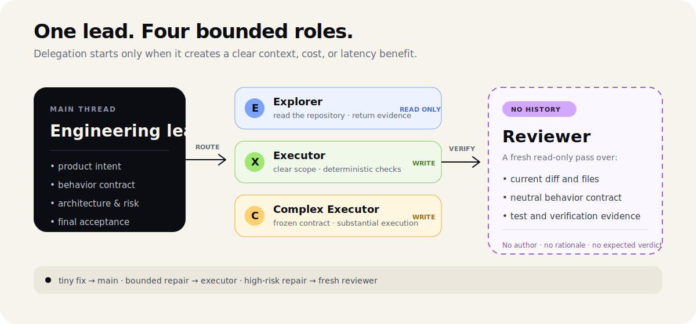

<p align="right">
  <a href="./README.md">English</a> · <strong>简体中文</strong>
</p>

<p align="center">
  
</p>

`team-mode`（小队模式）是一个负责协调四个自定义 Agent 的 Codex Skill，适用于有一定规模的开发、调研、分析、规划、文档、数据和内容任务。主线程保留尚未解决的决策并验收最终结果；子 Agent 负责适合专注上下文、较低成本、安全并行或独立判断的工作。

它提供的是调度方法，不要求每次走完固定流程。

## 四个角色

- **Explorer（探索者）· Luna Medium · 只读**：从当前网页、文档、数据、代码、API、日志和配置中查找证据。
- **Executor（执行者）· Luna Medium · 可写**：完成边界清楚、风险较低，而且能明确验证的工作。
- **Complex Executor（复杂执行者）· Sol High · 可写**：在目标和安全边界已经明确后，完成复杂但有边界的任务。
- **Reviewer（复审者）· Sol High · 只读**：使用全新上下文独立检查稳定的代码、报告、方案、分析、数据和其他产物。

Luna 承担日常探索和执行，控制成本；Sol 留给重要的复杂执行与独立复审，因为这些环节漏掉关键细节的代价更高。

TOML 里的 sandbox 是 profile 默认值，不是绝对隔离边界；父线程的实时权限覆盖可能重新应用到子 Agent。使用任务级 usage 报告核对每个 session 的实际 sandbox。

## 怎么调度

- 当委派、并行、上下文隔离、低成本执行或独立复审有明确价值时，开启小队模式。
- 小队模式也可以不启动任何子 Agent。简单明确的工作由主线程直接完成，不为了补齐流程而调用执行者或复审者。
- 每次派发前先说明它带来的实际收益，并把 brief、检查、等待和返工计入协调成本。明确调用小队模式不代表必须启动子 Agent。
- 每个子 Agent 都要收到包含 `Outcome`、`Benefit`、`Sources`、`Scope`、`Checks`、`Stop when` 和 `Return` 的 dispatch packet；字段不完整或收益不足以覆盖协调成本时，任务留在主线程。
- 需要一定范围的只读探索时交给 `Explorer`；主线程可以等待结果，不重复做同样的工作。
- 探索完成后，主线程根据上下文、成本、风险和协调价值，决定自己继续还是委派。
- 同一主题、系统、产物或工作线的已有上下文仍然有用时，复用原来的 Explorer 或执行者。
- 使用 `fork_turns="none"` 时，brief 必须列出事实判断所需的全部来源；只在主线程对话里出现过的材料不会自动传给子 Agent。
- 只有独立判断确实有价值时才使用 `Reviewer`，并且每次新的 Reviewer 都不继承历史对话。它的 packet 还必须列出未解决风险、精确证据、已通过检查、不要重复的验证和有边界的停止条件。
- 标准 Team Mode 的所有派发都留在主线程；子 Agent 不再创建后代 Agent。
- 只有互不依赖的工作才并行，同一个共享目标只保留一个写入者。
- 子 Agent 报错或中断后先检查共享产物，再决定是否重试；已有结果可以恢复时不重复执行。
- 主线程检查真实来源、产物、改动和验证结果，再决定是否接受子 Agent 的工作。

普通聊天、简单查询，以及调度成本高于任务本身的工作，留在主线程直接完成。

## 安装

先安装 Skill：

```bash
npx skills add oil-oil/codex-team-mode
```

四个自定义 Agent 配置与 Skill 分开安装。个人使用时，把 [`agents/`](./agents) 里的 TOML 模板复制到 `~/.codex/agents/`；只给单个项目使用时，复制到 `<repository>/.codex/agents/`。

准确文件名、安全安装、验证、修复和模型调整都写在 [自定义 Agent 配置说明](./skills/team-mode/references/custom-agents.md) 里。如果安装后没有立即显示新的 Agent，可以新建一个 Codex 任务或重启 Codex。

## 使用

任务达到一定规模时，这个 Skill 可以自动触发。你也可以明确调用：

```text
使用 $team-mode 完成这个任务。选择够用的最小小队，尚未解决的决策和最终验收留在主线程。
```

用户不用逐个指定 Agent。主线程会选择够用的最小团队，并对汇总后的结果负责。

## 自定义

你可以修改 `agents/*.toml` 中的 `model` 和 `model_reasoning_effort`。角色边界建议保留：Explorer 和 Reviewer 只读，修改权限只交给执行者，新的复审使用全新上下文，最终验收留在主线程。

## 仓库结构

```text
codex-team-mode/
├── agents/                  # 四个 Codex 自定义 Agent 模板
├── assets/readme/           # GitHub-safe SVG 视觉素材
├── skills/team-mode/        # 可以安装的 Skill
│   ├── agents/openai.yaml
│   ├── references/         # Agent 配置与评估方法
│   ├── scripts/usage_by_model.py
│   └── SKILL.md
├── tests/                   # Agent、路由与用量回归测试
├── LICENSE
└── README.md
```

<p align="center">
  <a href="https://github.com/oil-oil/beautify-github-readme"></a>
</p>

MIT License
